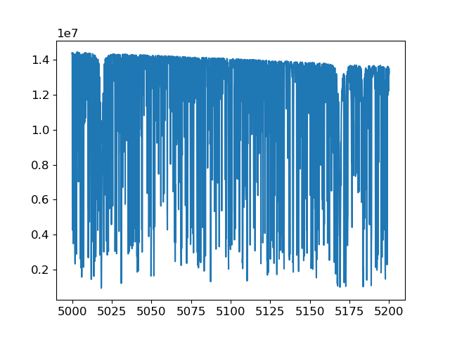

********
Examples
********

Running Turbospectrum
=====================
You need to supply |Turbospectrum| with 1) a model atmosphere, 2) a linelist (or multiple linelists), and 3) the set of stellar
parameters and abundances.

Here's a simple example:

    >>> from turbospectrum import synthesis,utils
    >>> atmod = utils.testdir()+'s6000_g+1.0_m0.5.mod'
    >>> linelists = [utils.testdir()+'nlte_linelist_test.txt',utils.datadir()+'Hlinedata']
    >>> flux,cont,wave = synthesis.synthesize(6000.0,1.0,0.5,atmod=atmod,linelists=linelists,wrange=[5000,5200])

Now plot the spectrum:

    >>> import matplotlib.pyplot as plt
    >>> plt.plot(wave,flux)

It should look like this.

    
